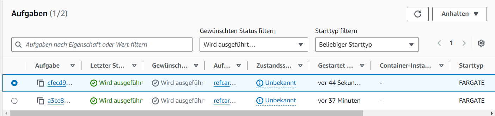

# Architecture Ref.Card 02 with AWS
## Creation of the Github Repository
First I cloned the repository
```sh
git clone https://gitlab.com/bbwrl/m346-ref-card-02.git
```
Then I created a Github Repository. I changed the remote URL from origin to the URL from the newly created Github Repository:
```sh
git remote set-url origin git@github.com:007anthony/m324-refcard-02-aws.git
```
Finally I pushed all the existing commits commits to my newly created Github Repository.
```sh
git push --set-upstream origin main
```

## Create the Workflow
First I created the structure with all required fields. As The name of the Workflow I used `Push to ECR`. It should be started automatically when I push something in the main-branch.
```yaml
name: Push Image to ECR
on: 
    push: 
        branches: 
            - main
```
### Versionising of the artifacts
To Versionize the artifact I used releases. To add a artifact to a release I first had to create a release. For that I wrote the following Job:
```yaml
create-release:
  runs-on: ubuntu-22.04
  steps:
  - uses: actions/Checkout@v4

  - name: Get Project Version
      id: version
      run: echo version=$(node -p "require('./package.json').version") >> $GITHUB_OUTPUT

  - uses: actions/create-release@v1
      with:
      draft: false
      prerelease: false
      release_name: ${{ steps.version.outputs.version }}
      tag_name: ${{ github.ref}}
```
After I created the Release I could build the Artifa
