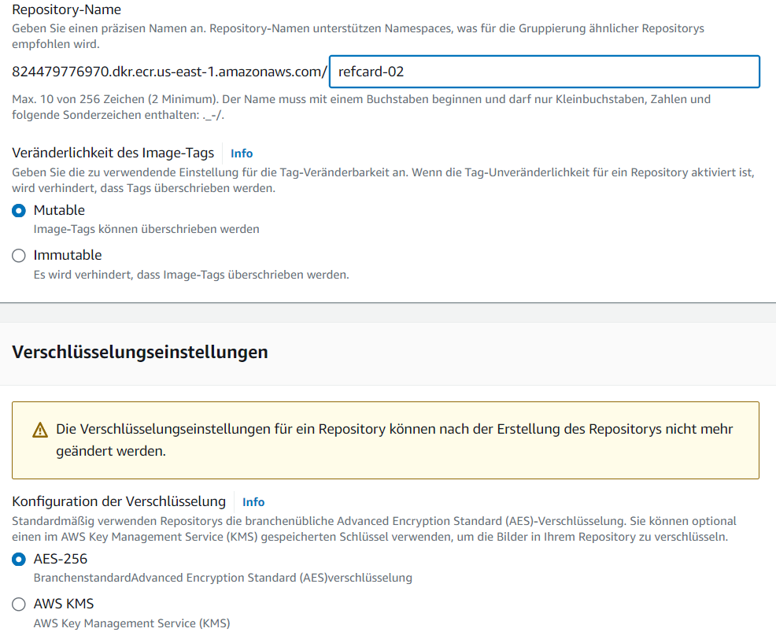
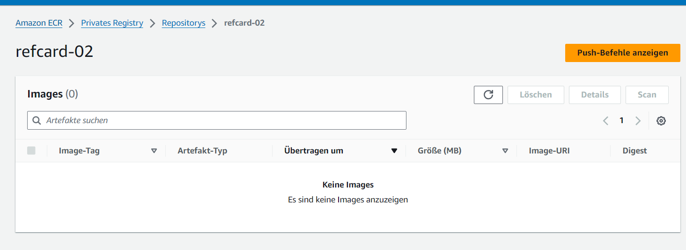
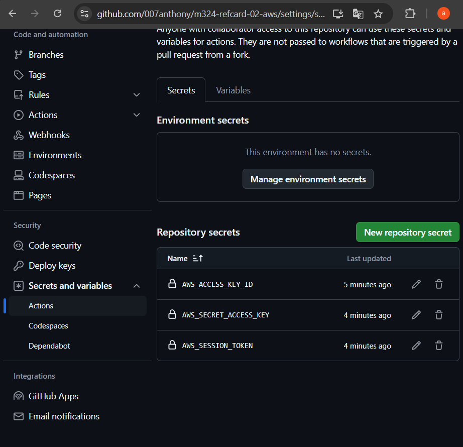

# Architecture Ref.Card 02 with AWS
## Creation of the Github Repository
First I cloned the repository
```sh
git clone https://gitlab.com/bbwrl/m346-ref-card-02.git
```
Then I created a Github Repository. I changed the remote URL from origin to the URL from the newly created Github Repository:
```sh
git remote set-url origin git@github.com:007anthony/m324-refcard-02-aws.git
```
Finally I pushed all the existing commits commits to my newly created Github Repository.
```sh
git push --set-upstream origin main
```

## Create ECR Instance
First I created a private repository. I called it refcard-02 becaus I will also name my image like this.

Then I got a empty repository. That is private.



## Create the Workflow
First I created the structure with all required fields. As The name of the Workflow I used `Push to ECR`. It should be started automatically when I push something in the main-branch.
```yaml
name: Push Image to ECR
on: 
    push: 
        branches: 
            - main
```
### Versionising of the artifacts
To Versionize the artifact I used releases. To add a artifact to a release I first had to create a release. For that I wrote the following Job:
```yaml
create-release:
  runs-on: ubuntu-22.04
  steps:
  - uses: actions/Checkout@v4

  - name: Get Project Version
      id: version
      run: echo version=$(node -p "require('./package.json').version") >> $GITHUB_OUTPUT

  - uses: actions/create-release@v1
      with:
      draft: false
      prerelease: false
      release_name: ${{ steps.version.outputs.version }}
      tag_name: ${{ github.ref}}
```
To create a release I had to set the Permissions of the workflow to write. I navigated to `Settings > Actions > General` and there was a tab called workflow permissions.

## Create Artifact
I built the file and then I uploaded the artifact into Github. First I tried to upload it to the release directly. But it didn't work like I wanted it to work. So I simply used the upload-artifact action.
```yaml
create-artifact:
      runs-on: ubuntu-22.04
      needs: create-release
      steps:
        - uses: actions/Checkout@v4

        - name: Install Dependencies
          run: npm install

        - name: Run Tests
          run: npm run test -- --watchAll=false

        - name: Build Artifact
          run: npm run build

        - name: pack artifact
          run: zip -r refcard-02.zip ./build

        - name: upload Artifact
          uses: actions/upload-artifact@v4
          with:
            name: refcard-02
            path: build
```

### Building and Pushing the Docker Image
To push the Docker Image I first had to login to the ECR Instance. I did this by adding the keys from the AWS Academy as Secrets.

Then I created a job to build and push the image. In the step to login in I added the following environment Variables to log into the aws cli:
- `AWS_ACCESS_KEY_ID`
- `AWS_SECRET_ACCESS_KEY`
- `AWS_SESSION_TOKEN`

As values I used the Secrets. The entire job looked like this:
```yaml
build-image:
  runs-on: ubuntu-22.04
  needs: create-artifact
  steps:
    - uses: actions/Checkout@v4

    - uses: actions/download-artifact@v4
      with:
        name: refcard-02

    - name: Get Project Version
      id: version
      run: echo version=$(node -p "require('./package.json').version") >> $GITHUB_OUTPUT
      

    - name: Build Docker Image
      run: |
        docker build -t refcard-02
        
    
    - name: Login to ECR Instance
      env:
        AWS_SECRET_ACCESS_KEY: ${{ secrets.AWS_SECRET_ACCESS_KEY }}
        AWS_ACCESS_KEY_ID: ${{ secrets.AWS_ACCESS_KEY_ID }}
        AWS_SESSION_TOKEN: ${{ secrets.AWS_SESSION_TOKEN }}
      run: aws ecr get-login-password --region ${{ vars.AWS_REGION }} | docker login --username AWS --password-stdin 824479776970.dkr.ecr.us-east-1.amazonaws.com


    - name: Tag Image
      run: |
        docker tag refcard-02 824479776970.dkr.ecr.us-east-1.amazonaws.com/refcard-02:latest
        docker tag refcard-02 824479776970.dkr.ecr.us-east-1.amazonaws.com/refcard-02:${{ steps.version.outputs.version }}

    - name: Push Image to ECR Instance
      run: | 
        docker push 824479776970.dkr.ecr.us-east-1.amazonaws.com/refcard-02:latest
        docker push 824479776970.dkr.ecr.us-east-1.amazonaws.com/refcard-02:${{ steps.version.outputs.version }}
```

## Create ECS Instance
