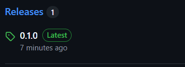
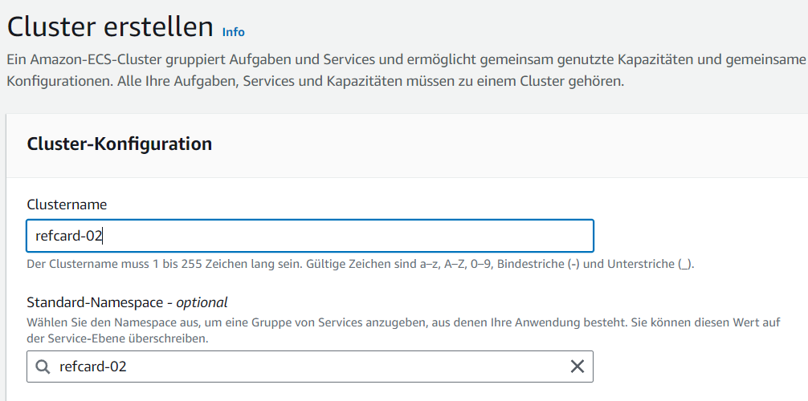

# Architecture Ref.Card 02 with AWS
## Creation of the Github Repository
First I cloned the repository
```sh
git clone https://gitlab.com/bbwrl/m346-ref-card-02.git
```
Then I created a Github Repository. I changed the remote URL from origin to the URL from the newly created Github Repository:
```sh
git remote set-url origin git@github.com:007anthony/m324-refcard-02-aws.git
```
Finally I pushed all the existing commits commits to my newly created Github Repository.
```sh
git push --set-upstream origin main
```

## Create ECR Instance
First I created a private repository. I called it refcard-02 becaus I will also name my image like this.

Then I got a empty repository. That is private.


## Create the Workflow
First I created the structure with all required fields. As The name of the Workflow I used `Push to ECR`. It should be started automatically when I push something in the main-branch.
```yaml
name: Push image to ECR
on: 
    push: 
        branches: 
            - main
```
### Versionising of the artifacts
To Versionize the artifact I used releases. To add a artifact to a release I first had to create a release. For that I wrote the following Job:
```yaml
create-release:
  runs-on: ubuntu-22.04
  steps:
  - uses: actions/Checkout@v4

  - name: Get Project Version
      id: version
      run: echo version=$(node -p "require('./package.json').version") >> $GITHUB_OUTPUT

  - uses: actions/create-release@v1
      with:
      draft: false
      prerelease: false
      release_name: ${{ steps.version.outputs.version }}
      tag_name: ${{ github.ref}}
```
To create a release I had to set the Permissions of the workflow to write. I navigated to `Settings > Actions > General` and there was a tab called workflow permissions.

I added a release so that it is visible for everyone which the current version is and so that it isn't possible to use two times the same version. So the version has to be different everytime.
^

## Create Artifact
I built the file and then I uploaded the artifact into Github. First I tried to upload it to the release directly. But it didn't work like I wanted it to work. So I simply used the upload-artifact action.
```yaml
create-artifact:
      runs-on: ubuntu-22.04
      needs: create-release
      steps:
        - uses: actions/Checkout@v4

        - name: Install Dependencies
          run: npm install

        - name: Run Tests
          run: npm run test -- --watchAll=false

        - name: Build Artifact
          run: npm run build

        - name: upload Artifact
          uses: actions/upload-artifact@v4
          with:
            name: refcard-02
            path: build
```

### Building and Pushing the Docker image
To push the Docker image I first had to login to the ECR Instance. I did this by adding the keys from the AWS Academy as Secrets.

Then I created a job to build and push the image. In the step to login in I added the following environment Variables to log into the aws cli:
- `AWS_ACCESS_KEY_ID`
- `AWS_SECRET_ACCESS_KEY`
- `AWS_SESSION_TOKEN`

As values I used the Secrets. For the login into the ECR and building and pushing a image to the Registry I used the manual provided by AWS. It was shown to me after I "clicked show Push Actions".

The entire job looked like this:
```yaml
build-image:
  runs-on: ubuntu-22.04
  needs: create-artifact
  steps:
    - uses: actions/download-artifact@v4
      with:
        name: refcard-02         

    - name: Build Docker image
      run: |
        docker build -t refcard-02 .
        
    
    - name: Login to ECR Instance
      env:
        AWS_SECRET_ACCESS_KEY: ${{ secrets.AWS_SECRET_ACCESS_KEY }}
        AWS_ACCESS_KEY_ID: ${{ secrets.AWS_ACCESS_KEY_ID }}
        AWS_SESSION_TOKEN: ${{ secrets.AWS_SESSION_TOKEN }}
      run: aws ecr get-login-password --region ${{ vars.AWS_REGION }} | docker login --username AWS --password-stdin 824479776970.dkr.ecr.us-east-1.amazonaws.com


    - name: Tag image
      run: |
        docker tag refcard-02 824479776970.dkr.ecr.us-east-1.amazonaws.com/refcard-02:latest
        docker tag refcard-02 824479776970.dkr.ecr.us-east-1.amazonaws.com/refcard-02:${{ needs.create-artifact.outputs.version }}

    - name: Push image to ECR Instance
      run: | 
        docker push 824479776970.dkr.ecr.us-east-1.amazonaws.com/refcard-02:latest
        docker push 824479776970.dkr.ecr.us-east-1.amazonaws.com/refcard-02:${{ needs.create-artifact.outputs.version }}
```
How you can see I changed some other stuff in the other jobs. For instance I set the version as an output on both jobs. Another change I did was adding the newly created Dockerfile to the artifact. The Dockerfile looks like this:
```Dockerfile
FROM nginx:1.27.2
COPY ./build /usr/share/nginx/html
```
The Dockerfile was pretty simple. I only had to make a image with nginx and copy all buildfiles to the html folder.

After some trial and error I successfully created the Pipeline. Now it's able to build an image of the build files and push the image into the ECR Registry.


## Create ECS Instance
### Task Definition
First I created a Task Definition. Here I had to define which image should be pulled and where this image is located. I named the Taskdefinition `refcard-02`.

I used Fargate for the Infrastructure because this is serverless. So it costs only when it's in use.

Then I had to configure the container. I added the images/image. Then I mapped the port 80 So that I can access this port.


### ECS Cluster
After I created the Task Definition I was able to create the ECS Cluster. Here I only had to type in the Clustername.


In the Cluster I created a service. For this Service I also used Fargate. 

Then I chose the Taskdefinition that I created. 

So that it's would always redeploy the image when it changes I configured the following:

In the Network configuration I had to setup a new security group. Here I opened the Port 80 for every client.

After everything was created I was able to add the access the Application with the public IP in the task that was created in the service.


To test everything I changed the version and pushed the new changes. So it should deploy the new image into the ECR and redeploy the ECS Service.


After the Pipeline ran there was no redeployment. So this didn't worked. So I chose to trigger the redeployment in the workflow. For that I created the following job:
```yaml
update-ecs:
  runs-on: ubuntu-22.04
  needs: build-image
  steps:
    - name: Redeploy ECS
      env:
        AWS_SECRET_ACCESS_KEY: ${{ secrets.AWS_SECRET_ACCESS_KEY }}
        AWS_ACCESS_KEY_ID: ${{ secrets.AWS_ACCESS_KEY_ID }}
        AWS_SESSION_TOKEN: ${{ secrets.AWS_SESSION_TOKEN }}
      run: aws ecs update-service --cluster refcard-02 --service refcard-02 --region ${{ vars.AWS_REGION }}--force-new-deployment
```